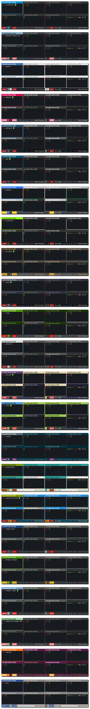

## j4-make-config (a.k.a. i3-theme)

#### Universal theme switcher and config generator for the i3 wm

### Overview

The purpose of this script for the i3 windowmanager is to easily switch
between several sets of configuration options ("themes"), but also to
easily put together a complete config from several different configuration
parts, depending on the environment you are currently working in.

Themes can be used to set:

- borderstyle
- window and i3bar colors
- window and i3bar font
- layout mode
- i3bar position
- desktop (root window) background
- keybinding to call dmenu with matching colors
- and much more - any i3 configuration option can be used!

A collection of theme files is distributed together with
j4-make-config to give the user a variety of themes to choose from.

By utilizing rofi, j4-make-config provides a graphical menu to select a theme ("interactive mode"):

j4-make-config can also put together a complete config from several different
configuration parts, depending on the environment you are currently working in.
So you can do things like:

- have different layouts and font sizes for different screen sizes
- have one i3bar section for your laptop and two i3bar sections for your dual monitor setup at home
- have different keybindings depending on the keyboard you are using
- and much more - any i3 configuration option can be used!

j4-make-config stores the most recently used arguments in */home/yourUserName/.j4-make-config.rc*,
so you can easily refresh your i3 config by running *j4-make-config* without arguments
or by running *source /home/yourUserName/.j4-make-config.rc*. If you pulled in
changes of parts of your config or themes, your i3 config will get updated
automatically.

### Screenshots

Everybody loves screenshots, so here they are. Click the image to view it in fullsize.

### Requirements

j4-make-config has the following requirements:

- Python 2 or 3
- rofi (optional - to choose a theme in interactive mode)
- xsetroot (optional for setting the root window background)

### Usage

To create an i3 configuration which includes a specific theme, run:

    j4-make-config <theme-name>

To create an i3 configuration without including a theme, run:

    j4-make-config none

To let j4-make-config reload i3 after creating an i3 configuration, run:

    j4-make-config -r <theme-name>|none

To use the interactive mode to choose a theme (reloads i3, requires rofi), run:

    j4-make-config -i

To append additional configuration from files in the i3 config directory, run:

    j4-make-config -a <file-name> -a <another-file-name> <theme-name>|none

To append additional configuration and reload i3 after creating the config file, run:

    j4-make-config -r -a <file-name> <theme-name>|none

To run j4-make-config with the most recently used arguments:

    j4-make-config

### Installation

Place *j4-make-config* anywhere in your $PATH, for example in
*/home/yourUserName/bin*, and ensure that it is executable. Move the
directory named *themes* to the directory where your i3 config file is.

After that, you should prepare your i3 config file for *j4-make-config*.
If you already have window color settings in your i3 config file, you
should completely replace them with a marker which gets replaced with the
window configuration included in the chosen theme file. We demonstrate
this with the default color settings (normally they are not explicitly set
in the i3 configuration file):

Replace the default colors

    # class                 border  backgr. text    indicator
    client.focused          #4c7899 #285577 #ffffff #2e9ef4
    client.focused_inactive #333333 #5f676a #ffffff #484e50
    client.unfocused        #333333 #222222 #888888 #292d2e
    client.urgent           #2f343a #900000 #ffffff #900000

with the following marker:

    # $i3-theme-window

If you didn't configure custom window colors yet, you can simply add the
marker *# $i3-theme-window* at the end of your i3 config file.
Please note that the marker begins with the character '#' because it is
a comment in the i3 configuration.

You can apply the same procedure to prepare your bar section for
*j4-make-config*. If we take the default bar colors for example (normally
they are not explicitly set in the i3 config file), your bar section
should look like this:

    bar {
        status_command i3status
        colors {
            background #000000
            statusline #ffffff
            separator #666666
    
            focused_workspace  #4c7899 #285577 #ffffff
            active_workspace   #333333 #5f676a #ffffff
            inactive_workspace #333333 #222222 #888888
            urgent_workspace   #2f343a #900000 #ffffff
        }
    }

Replace the whole colors section with the following marker:

    # $i3-theme-bar

If you didn't configure custom bar colors yet, you can simply add the
marker *# $i3-theme-bar* at the bottom of your bar section.

As a last step, you should rename your *config* file to *config.base*.
Now you are prepared for running *j4-make-config* for the first time.

**Hint:**

You can also add those markers to the additional configuration
files you want to append. They will also get replaced with the
configuration options in the theme file.

For example, you can have different i3bar sections in different additional
configuration files and still have them themed by adding those markers.

**Generating the config file:**

To understand what will happen, we take a look at the structure of a
theme file:

    # $i3-theme-window
    ...
    some configuration options
    ...
    
    # $i3-theme-bar
    ...
    some configuration options
    ...

Here's what j4-make-config will do:

- read the contents of *config.base*, the additional configuration file(s)
and the theme file you provided as commandline arguments
- concatenate the contents of *config.base* and the additional configuration
file(s)
- replace the marker *# $i3-theme-window* with the configuration options
after this marker in the theme file
- replace the marker *# $i3-theme-bar* with the configuration options
after this marker in the theme file
- leave *config.base* untouched, instead it will write the resulting
configuration to a new i3 *config* file

### License

This software is released under the terms of the
GNU General Public License v2:

[http://www.gnu.org/licenses/old-licenses/gpl-2.0.txt](http://www.gnu.org/licenses/old-licenses/gpl-2.0.txt)

The theme files are either ports of themes from other window managers,
assembled from i3 configurations found on the net or original themes
done by various people. I do not have any copyright for them except when
stated differently.

### Authorship, feedback, questions and contributions

Please feel free to open issues on github for bugreports, feature requests
and new themes. You can also contact me in *#j4tools* and *#i3* on the
freenode IRC network.

### Todo list

These are things which are planned to be done, at some point
in the future.

- use argparse
- have more than 2 markers, that means: exchange each marker
  in the config.base file with the corresponding marker in
  the theme file (or in a host-specific config file)
- optional: j4-make-config starts i3 after it generated a
  temporary config file
- put every theme in a separate directory - this would help to
  - provide variations of themes
  - enable users to make modifications of themes
  - provide additional files like licences or README files
- add mechanism to color dmenu output in themes and use a specific font
- add themeing and additional config parts to i3status config
